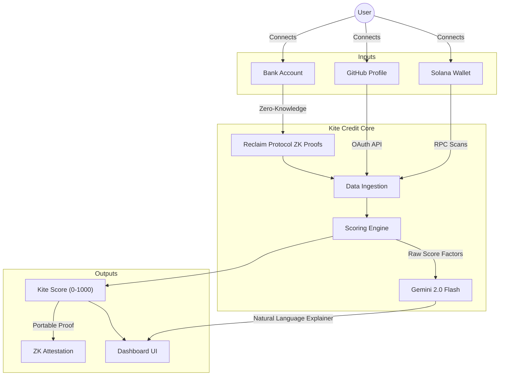
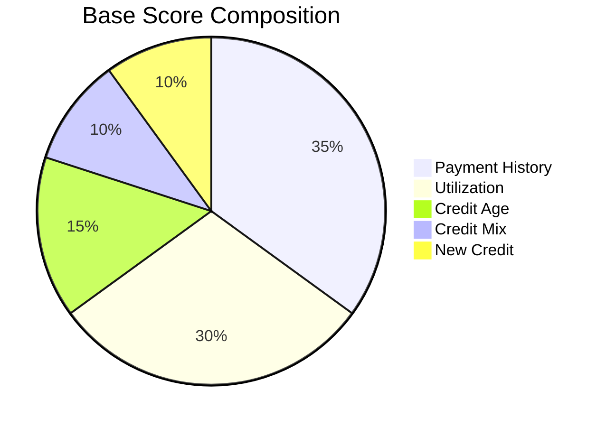

# Kite Credit

**A persistent, cross-border credit score that follows you wherever you go.**

---

## Technical Architecture

Overview of how Kite Credit aggregates, verifies, and processes off-chain and on-chain identity data.



---

## The Problem

**Financial identity is trapped in silos.**

Moving across borders erases your financial identity. Years of responsible borrowing, consistent income, and professional reputation vanish the moment you step into a new country. Billions of people are locked out of housing, lending, and basic financial services because their history doesn't travel with them.

Traditional credit bureaus (Equifax, Experian) are:
1.  **Region-locked:** Your US credit score means nothing in the UK or Singapore.
2.  **Opaque:** You don't know exactly why your score changed.
3.  **Slow:** It takes months or years to build a history.

## What Kite Credit Does

Kite Credit builds a **portable, user-owned credit score** by pulling from three distinct sources of reputation:

1.  **On-chain activity:** Your behavior on Solana (DeFi repayments, staking, wallet age).
2.  **Professional history:** Your GitHub profile (commit consistency, repo longevity).
3.  **Traditional cash flow:** Your bank balances and income consistency, verified through **Zero-Knowledge (ZK) Proofs**.

These three inputs are weighted and combined into a single Kite Score on a **0-1000** scale.

---

## Dynamic Scoring Engine

Unlike static credit models, Kite Credit uses a **Dynamic Signal Strength** model. It adapts based on the *quality* and *amount* of data you provide. 

### How It Works

The engine calculates a "Signal Strength" (0.0 - 1.0) for each data source to determine how much weight to assign it.

*   **Scenario A: Crypto-Native (Solana Only)**
    *   If you only connect a wallet, your score is **100% based on on-chain activity**.
    *   *Good for:* Digital nomads, anon devs, DeFi power users.
*   **Scenario B: Hybrid (Solana + Bank)**
    *   If you connect both, the engine balances them. If your wallet is new (low signal) but your bank history is deep (high signal), the score will heavily weight the bank data (e.g., 90% Bank / 10% Solana) to give you the fairest score.
*   **Scenario C: Developer (GitHub Boost)**
    *   GitHub data acts as a **bonus layer** (up to +50 points). It doesn't penalize you if missing, but rewards professional consistency.

### The 5 Factors (FICO-Aligned)

Regardless of the source (Chain vs. Bank), we map data to the standard 5 pillars of creditworthiness:

| Factor | Weight | On-Chain Source | Off-Chain Source (ZK) |
| :--- | :--- | :--- | :--- |
| **Payment History** | 35% | DeFi loan repayments, liquidations | Income consistency, bill pay reliability |
| **Utilization** | 30% | Staking % vs. idle assets, collateral health | Balance health vs. spending |
| **Credit Age** | 15% | Wallet age (days since first tx) | Account longevity (proxy via income depth) |
| **Credit Mix** | 10% | Diversity of protocols (Lending, DEX, NFT) | Verification complexity (KYC tier) |
| **New Credit** | 10% | Recent wallet interactions (Baseline) | Recent verification inquiries |

### Visualization



---

## Privacy Architecture

Kite Credit does **not** store your raw bank transactions, private repository codes, or login credentials.

*   **Bank Data:** Verified via [Reclaim Protocol](https://reclaimprotocol.org/). You generate a ZK-proof on your device (client-side) that asserts facts (e.g., "I have >$5k balance") without sharing the login or statement. Kite only sees the true/false proof.
*   **Attestations:** The final output is a portable JSON objectsigned by Kite, containing your score and tier (e.g., "Elite"). You can share this object with lenders or landlords without revealing your entire history.

---

## Roadmap & Long-Term Goals

**Mission:** To create the global standard for portable reputation.

### Phase 1: Aggregation (Current)
*   [x] MVP Dashboard
*   [x] Solana Wallet Analysis
*   [x] GitHub Integration
*   [ ] Full ZK Bank Verification (In Progress)

### Phase 2: Utility (Next 3-6 Months)
*   **Undercollateralized Lending:** Partner with DeFi protocols to allow "Elite" tier users to borrow against their Kite Score with lower collateral ratios.
*   **Rent/Housing:** Pilot program with crypto-friendly rentals / Airbnbs to accept Kite Score instead of local credit checks.

### Phase 3: Decentralization (1 Year+)
*   **On-Chain Identity:** Mint Score as a Soulbound Token (SBT) or Verifiable Credential (VC).
*   **Governance:** Community DAO decides weighting parameters and new data integrations.

---

## Tech Stack

*   **Frontend:** Next.js (App Router), React, Tailwind CSS, Framer Motion
*   **Blockchain:** Solana (Web3.js, Helius RPC)
*   **ZK Proofs:** Reclaim Protocol
*   **AI:** Google Gemini 2.0 Flash (for natural language score explanations)
*   **Deployment:** Vercel

## Running Locally

```bash
# Install dependencies
npm install

# Run development server
npm run dev
```

Open [http://localhost:3000](http://localhost:3000) to view the app.

---
*Built by [Asad](https://github.com/archdiner) as part of the Kite Credit initiative.*
